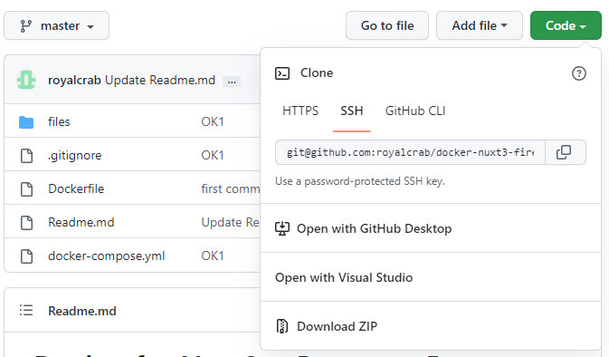

# Docker for Nuxt3 + Bootstrap5 + Firebase 

プロジェクトを作成したいフォルダ以下に、下記ファイルを置く。

```
.
├─Dockerfile
├─docker-compose.yml
└─files
   ├─env
   ├─firebase.client.ts
   ├─firebase.json
   ├─nuxt-create.sh
   └─nuxt.config.ts
```

ファイルは、github のページの右上の Code のところにある Download ZIP で取得できる。



## Build

最初の1回目だけ実行する。Docker の image が作成される。

```
$ docker compose build
```

## Create New Nuxt3 Project

最初の1回目だけ実行する。

```
$ docker compose run --rm create
```

これで、./work 以下にプロジェクトが作成される。 work 以下はだいたい下記のようになっているはず。


```
.
└─work
    ├─.env
    ├─.nuxt
    │  └─この下には大量のファイル
    ├─.output
    │  └─public
    ├─node_modules
    │  └─この下には大量のファイル
    ├─.gitignore
    ├─app.vue
    ├─firebase.json
    ├─nuxt.config.ts
    ├─package.json
    ├─plugins
    │  └─firebse.client.ts
    ├─README.md
    ├─tsconfig.json
    └─yarn.lock
```

git を使ってバージョン管理をする場合は work のフォルダ内で `git init` する。
このとき、Dockerfile のあるフォルダに .git フォルダがあるとエラーになる。
必要に応じて削除しておく。

## Test Project

```
$ docker compose up dev
```

http://localhsot:3000 を開いて Nuxt3 のページが表示されたらOK

Control + C で停止させたときは、その直後に 
`docker compose down dev` としておく。そうしないと、
動いてないコンテナが大量に残ってしまう。

## firebase init

最初に１回だけ必要。

```
$ docker compose up sh -d
$ docker compose exec sh firebase login --no-localhost

...

2. Visit the URL below on any device and follow the instructions to get your code:

https://auth.firebase.tools/login?code_challenge=xxxxxxxxxxxxxxxxxx

3. Paste or enter the authorization code below once you have it:

? Enter authorization code:
```

2 のところにURLが表示されるので、それをブラウザで開く。
そして、google アカウントでログインすると、認証コードが表示されるので、それを 3 の
Enter authorization code: の後ろにコピペする。

## firebase init

```
$ docker compose exec sh firebase init
```

.env ファイルを編集して、firebase の apiKey などの情報を追記する。

```.env
NUXT_FIREBASE_API_KEY=
NUXT_FIREBASE_AUTH_DOMAIN=
NUXT_FIREBASE_PROJECT_ID=
NUXT_FIREBASE_STRAGE_BUCKET=
NUXT_FIREBASE_MESSAGING_SENDER_ID=
NUXT_FIREBASE_APP_ID=
```

## start firebase emulators

firebase.json のエミュレータの各項目に "host":"0.0.0.0" を追加する。すでに追加されている場合は、しなくていい。

```firebase.json
  "emulators": {
    "auth": {
      "host": "0.0.0.0",
      "port": 9099
    },
    "firestore": {
      "host": "0.0.0.0",
      "port": 8080
    },
    "hosting": {
      "host": "0.0.0.0",
      "port": 5000
    },
    "storage": {
      "host": "0.0.0.0",
      "port": 9199
    },
    "ui": {
      "host": "0.0.0.0",
      "enabled": true
    }
  }
```

この状態で、下記を実行する。

```
$ docker compose up emu
```

Control + C で停止させたときは、その直後に 
`docker compose down emu` としておく。そうしないと、
動いてないコンテナが大量に残ってしまう。

## Build / Deploy

```
$ docker compose exec sh yarn build
$ docker compose exec sh firebase deploy
```

`exec` が失敗するときは、先に下記をやっておく。

```
$ docker compose up sh -d
```

# 何かおかしくなったら

```
$ docker compose down
$ docker compose up sh -d
```

とやると、たぶん直る（はず）。

